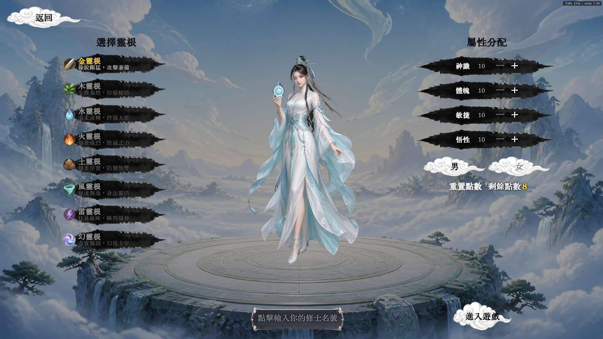
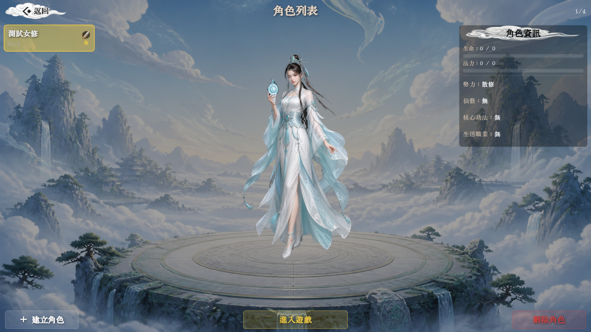

# PNG Alpha 與渲染透明度修復驗收

日期：2026-09-18

## 結果與範圍

已修復女性頭髮去背破洞、男性實心主體輕微 Alpha 衰減，以及家具本體／獨立陰影在搬動時不同步的問題。創角與選角共用新版立繪，Web 離線實測可正常切換；登入透明容器與白字黑描邊維持原樣。

完成全專案檔案、引用、Alpha 像素及渲染設定盤點；**這不代表所有伺服器場景或原生裝置已逐一實測**。已知缺檔、停用素材問題及未測範圍列於下方，沒有將它們標記為已修復。

## 根因與修正

| 項目 | 證據 | 修正 |
| --- | --- | --- |
| 女性頭髮破洞 | 原圖 `(350,123)` 的 RGBA 為 `(0,0,0,0)`；RGB 已遺失。臉、胸口、裙裝與腿部抽樣 Alpha 原本就是 255 | 以原圖為底，僅在人工核對的頭髮內部遮罩修補 3,016 個像素；其餘 RGBA 逐像素完全保留 |
| 女性全身看似透明 | 黑／白／棋盤／洋紅合成圖及身體樣本顯示，不能把原圖的薄紗繪法當成全身透明度錯誤 | 不改臉、姿勢、衣料或膚色，不把薄紗與透明外圍填實 |
| 男性主體 Alpha | 修前可見像素中 99.79% 屬於半透明，多數實心區接近 252–253，而非 255 | 僅當周圍 7×7 像素 Alpha 全部 ≥240 時補至 255，共 274,092 像素；RGB 與外緣覆蓋完全不變 |
| 背景蒙版 | 創角與選角的 0.35 黑色蒙版均位於立繪後方；立繪沒有父層 Opacity 衰減 | 保留原層級，不把背景調暗誤當人物透明來源 |
| 家具搬動陰影 | `IsoObjectComponent.opacity` 原本是普通欄位，兄弟元件陰影保留建立時的值 | 改成 setter，同步本體與陰影；取消搬動恢復 1，保留材質陰影本身 0.3 等設定 |

女性修補使用內建 imagegen 產生頭髮細節參考。候選有畫入的棋盤背景且臉部略有變化，因此**未整張採用**；只在原圖缺失的頭髮遮罩內取深色像素，其餘原圖不變。輸入、遮罩與重跑配方均已保留。生成提示見 [imagegen_prompt.txt](alpha/imagegen_prompt.txt)。

## 全專案盤點

- 共 228 個圖像檔：`assets/` 185、平台啟動／圖示 42、根目錄預覽 1。排除 build、工具快取與本次報告圖片，避免重複把衍生檔算成來源。
- Flutter bundle 中 183 張專案 PNG 全部經 Flutter codec 解碼成功；兩張 `_demo` 未打包。
- 現行玩家圖集 815 幀、山野狼圖集 344 幀，合計 1,159 幀逐一檢查 rect 範圍與 Alpha；沒有解碼失敗或越界。未啟用的歷史圖集沒有可靠描述檔者只做全圖掃描，不猜測幀配置。
- 256 處透明度、混合、遮罩及相關設定已有檔名與行號清單。
- 檢視 6 張素材總覽，涵蓋所有未版本化的 `assets` 圖像；人物另有完整 Alpha 與四色背景合成對照。
- 地磚由 `S_MAP_TILES` 的 `tileDir + tiles[id]` 動態解析，地圖底圖由 mapId 解析；家具由 catalog／編輯器讀取。清單保留這些條件入口，沒有因為缺少字串引用就判定刪除。
- UI 雲紋、水墨邊緣、圖示、載入靈氣、聚靈法陣、怪物屍體淡出和家具 ghost 為刻意透明效果，未做全域拉高 Alpha。

清單與證據：

- [asset_alpha_inventory.csv](asset_alpha_inventory.csv)：逐檔雜湊、尺寸、Alpha 統計、用途、引用、風險與驗證層級。
- [asset_alpha_frames.csv](asset_alpha_frames.csv)：圖集逐幀結果。
- [render_opacity_inventory.csv](render_opacity_inventory.csv)：渲染設定位置。
- [bundle_decode.json](alpha/bundle_decode.json)：實際 Flutter bundle 解碼記錄。
- [reference_integrity.json](alpha/reference_integrity.json)：物件／怪物引用存在性。
- [repair_summary.json](alpha/repair_summary.json)：修復範圍與像素數。

## 驗收證據

最終回歸共 **26 項通過**，涵蓋：

- 打包 PNG 解碼、男女立繪修復遮罩、女性身體不透明抽樣、男性 RGB 和外緣不變。
- 創角男女切換，選角共用女性立繪，1920×1080、1280×720、1920×929 三種尺寸。
- 登入／選服桌面、窄視窗、手機尺寸；帳密保留、收合、不可選伺服器。
- 家具本體／陰影變淡與恢復、怪物死亡淡出時序。

本次新增工具、測試及修改的物件元件通過 Dart 靜態分析，無問題。

實際瀏覽器以 1280×720 驗證 Web release 離線入口：創角切換女角與選角顯示均正常；使用正式元件及正式素材、測試角色清單，不連線，也沒有建立、刪除或操作真實角色。畫面頂部 40px 是驗收工具列。三種無工具列尺寸另以 Flutter 渲染測試輸出：

[女性四色背景對照](alpha/char_female-backgrounds.png) · [原始女性四色對照](alpha/char_female_9387b9c6-backgrounds.png) · [女性修補遮罩](alpha/female_repair_mask.png)

## 仍需保留的問題與限制

| 項目 | 狀態與影響 | 後續處置 |
| --- | --- | --- |
| `pearl_01.png`、`pearl_01_flow.png` | 確認含畫入的棋盤格；`WeaponVisual.none` 為現行預設，所以不會自動顯示 | 保持停用。啟用武器外觀前需另做乾淨去背與漂浮定位驗收 |
| `cloud_label03.png` | 總覽可見疑似棋盤／陰影底；目前僅預載，没有可見呼叫者 | 啟用這個備用 label 前再針對美術背景確認，不影響現在使用的 cloud04 |
| `table001.png`、`table002.png` | catalog 仍引用但檔案不存在，屬既有缺檔而非 Alpha 問題 | 使用到這兩個物件 id 會走 fallback；需補正式桌子素材或另行整理 catalog |
| `warrok/goblin/demon/skeletonzombie.png` | 程式註解明示待生成的怪物圖集，現不存在 | 保留已有佔位圖形行為；不是已完成的正式美術 |
| 動態伺服器圖磚／物件組合 | 已追蹤載入入口並解碼本地打包素材，未逐一跑遍所有實際伺服器場景 | 需在有對應資料的遊戲環境補做逐場景目視驗收 |
| Android／iOS／macOS／Windows 原生啟動 | 圖片已掃描，未做實機啟動與 GPU 呈現驗證 | 有對應裝置／環境時補驗，不以 Web 成功代替 |

## 發布與重跑

正式引用：

| 用途 | 發布檔 | SHA-256 |
| --- | --- | --- |
| 女性 | `char_female_c96d2a75.png` | `c96d2a751bcc491c8dacf5dcf5010935191ddf3b626ed10cdb34b1311cfb2271` |
| 男性 | `char_male_67e084f8.png` | `67e084f8665335c8f711c9fa3fccaef377794f57c5d74d9f382d7a6e5da6683e` |
| 背景（未改） | `char_bg_68751985.png` | `68751985731fbaf5f16a1810afb51df2ead3a38902ba9dd6b06fc04c566d70ec` |

來源／發布檔／Dart 常數由同一工具同步，不以清快取代替修圖。正式 `build/web` 與離線 `build/alpha_preview` 分開，前者不包含測試角色入口。最終建置雜湊核對記錄見 `alpha/web_bundle_verification.json`。

重跑與發布命令見 [工具說明](../tools/assets/README.md)。既有工作區其他未提交修改保留，未提交 Git commit 或部署到外部站點。
